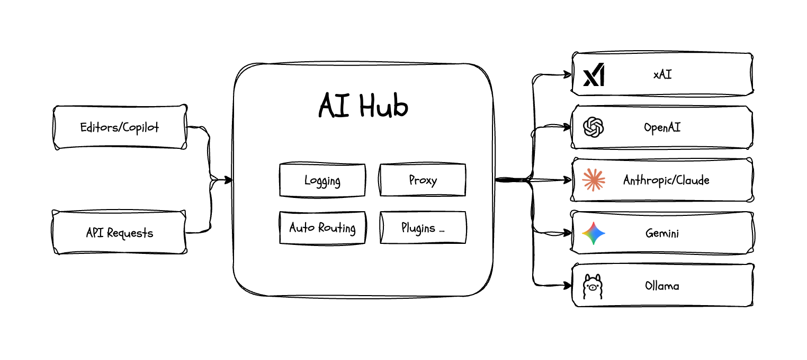

# AI Hub

A unified entry point for connecting multiple AI service prboviders.


## Installation

```bash
# Install Bun
curl -fsSL https://bun.sh/install | bash

# Clong this repository
git clone https://github.com/hangxingliu/ai-hub.git
cd ai-hub

# Install dependencies
bun install

# Generate your config from example.config.yaml
cp example.config.yaml config.yaml
code config.yaml

# Start the server
bun start
```


## Built-in Plugins

- `rewrite-model-id`: Rewrite model id. (For example: `models/gemini-2.5-flash` => `gemini-2.5-flash`)
- `remove-telemetry-headers`: Remove telemetry request headers from OpenAI SDK.
- `keep-only-last-message`: Keep only last user message and all other role's messages.
- `disable-models`: Disable some model by model IDs.
- `debug-request-messages`: Debug and print request messages.
- `replace-messages`: Replace some content in the message by keyword or regular expression.


## Build & Contributing

Please check out the document [docs/CONTRIBUTING.md](docs/CONTRIBUTING.md) for information
about building/contributing this project


## License

This project is licensed under the GNU Lesser General Public License v3.0 (LGPL-3.0). See the [LICENSE](LICENSE) file for details.

And this project uses some resources from internet, see the [README](assets/README.md) file in the _assets_ directory for details.
